# Jarkom-Modul-1-2026-K-47

| No | Nama | NRP |
|:---:|---|---|
| 1 | Elisabeth La Satta Sitorus | 5027251039 |
| 2 | Farrel Muhammad Athasyah Enrizy | 5027251100 |

## Pengerjaan Soal
Pengerjaan praktikum ini dilakukan di GNS3 Web Client dan GNS3 Dekstop dengan IP Server yang sudah disediakan oleh Asisten Praktikum.  
1. Masuk ke portal GNS3 Web Client sesuai IP Group Kelompok (Group C): http://10.4.89.250/
2. Masuk ke project sesuai kelompok yang sudah disediakan
3. Mulai pengerjaan soal
   
### Soal 1
1. Persiapkan NAT1 sebagai sumber internet
2. Persiapkan Router tersambung ke NAT1, beri nama dengan *change hostname* -> **Lain**
3. Buat 3 Switch yang tersambung ke **Lain** dengan nama **Switch 1**, **Switch 2**, dan **Switch 3**
4. Di **Switch 1**, sambungkan 2 Server Client (kami menggunakan Alpinet), beri nama dengan *change hostname* -> **Alisa** dan **Mika**
5. Di **Switch 2**, sambungkan 1 Server Client (kami menggunakan Alpinet), beri nama dengan *change hostname* -> **Chisa**
6. Di **Switch 3**, sambungkan 2 Server Client (kami menggunakan Alpinet), beri nama dengan *change hostname* -> **Knights** dan **Eiri**
7. Untuk menjadikan kelima server ini menjadi Client bagi **Lain**, *start configuration* Client menggunakan prefix IP K-47 `10.87.x.x`

#### Router
```
auto eth0
iface eth0 inet dhcp

auto eth1
iface eth1 inet static
    address 10.87.1.1
    netmask 255.255.255.0

auto eth2
iface eth2 inet static
    address 10.87.2.1
    netmask 255.255.255.0

auto eth3
iface eth3 inet static
    address 10.87.3.1
    netmask 255.255.255.0
```

#### Client Alice
```
auto eth0
iface eth0 inet static
    address 10.87.1.2
    netmask 255.255.255.0
    gateway 10.87.1.1
```

#### Client Mika
```
auto eth0
iface eth0 inet static
    address 10.87.1.3
    netmask 255.255.255.0
    gateway 10.87.1.1
```

#### Client Chisa
```
auto eth0
iface eth0 inet static
    address 10.87.2.2
    netmask 255.255.255.0
    gateway 10.87.2.1
```

#### Client Knights
```
auto eth0
iface eth0 inet static
    address 10.87.3.2
    netmask 255.255.255.0
    gateway 10.87.3.1
```

#### Client Eiri
```
auto eth0
iface eth0 inet static
    address 10.87.3.3
    netmask 255.255.255.0
    gateway 10.87.3.1
```

Hasil topologi:  
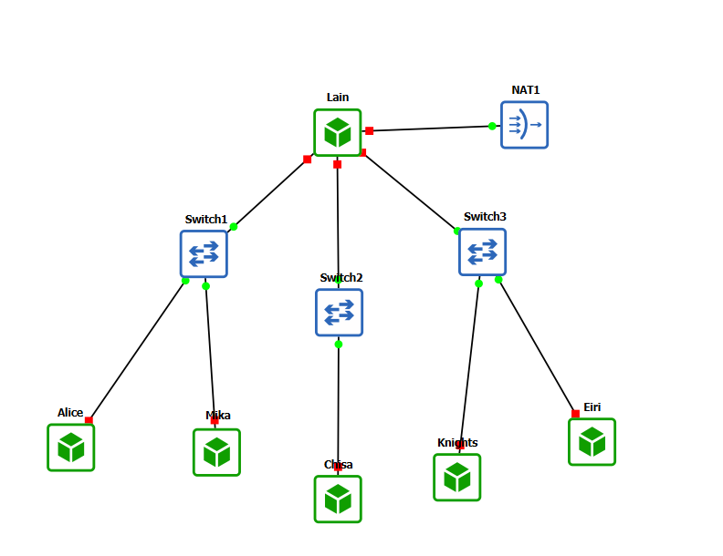

### Soal 2
Untuk menyambungkan **Lain** ke internet tambahkan config ini sebagai command,  
```
sysctl -w net.ipv4.ip_forward=1
iptables -t nat -A POSTROUTING -o eth0 -j MASQUERADE
ping 8.8.8.8 # tes internet
```
Command ini juga dapat dilakukan tiap ingin mengaktifkan internet **Lain**  
Hasil Tes:  
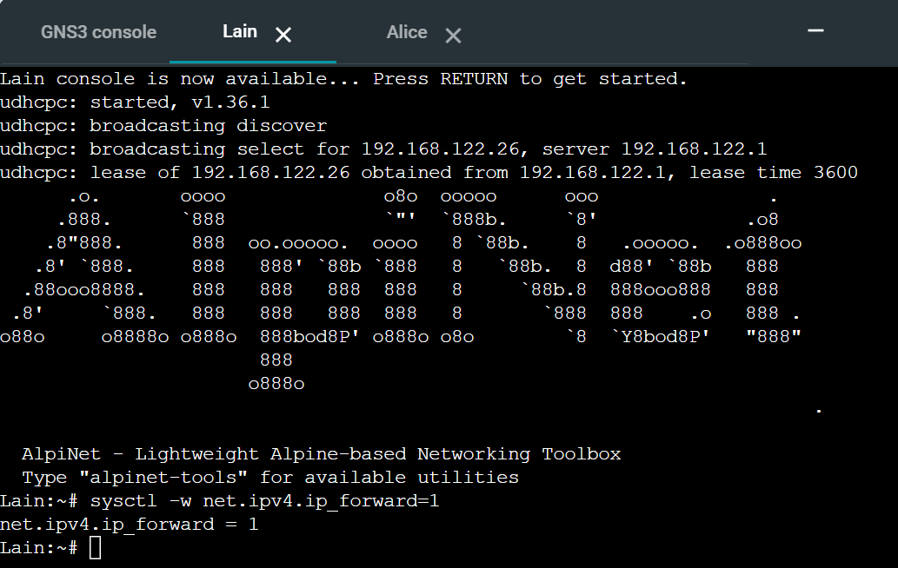  
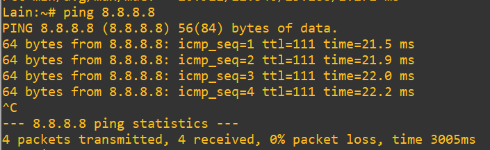

### Soal 3
Setelah **Lain** tersambung ke internet, kita juga ingin tiap Client dapat terkoneksi dan berkomunikasi satu sama lain dengan,  
1. Aktifkan internet **Lain**
   ```
   sysctl -w net.ipv4.ip_forward=1
   iptables -t nat -A POSTROUTING -o eth0 -j MASQUERADE
   ```
2. Buka console masing-masing Client, lalu tambahkan DNS Resolver:
   ```
   echo "nameserver 8.8.8.8" > /etc/resolv.conf
   ```
3. Cek IP Node Client lain dengan `ip a`, lalu tes koneksi:
   **Node Alice** -> **Node Chisa**  
   ```
   ping 10.87.2.2
   ```

Hasil Tes Koneksi:  
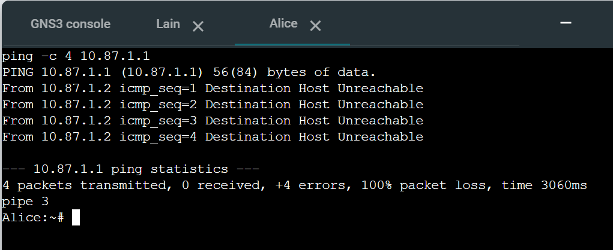

### Soal 4
Selain **Lain** yang dapat tersambung ke internet, Client juga harus bisa tersambung ke internet dengan konfigurasi,  
tolong isi ya farrel

Hasil Tes:  
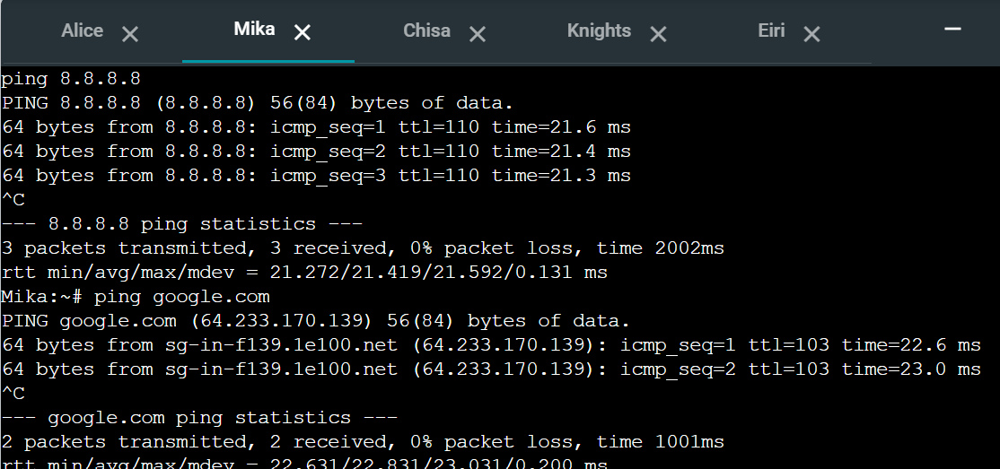  

### Soal 5
tolong isi ya farrel

Hasil Tes:   
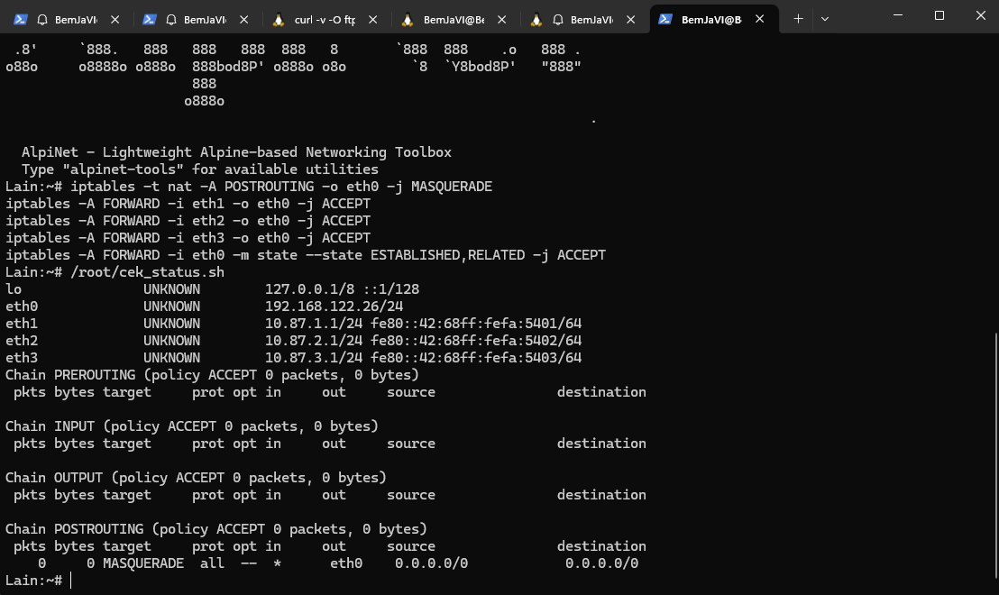

### Soal 6
tolong isi ya farrel

Hasil Tes:  
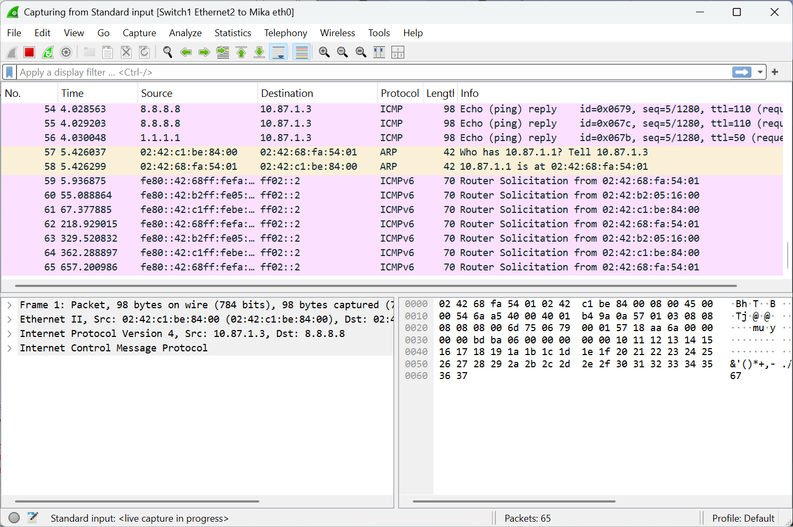  
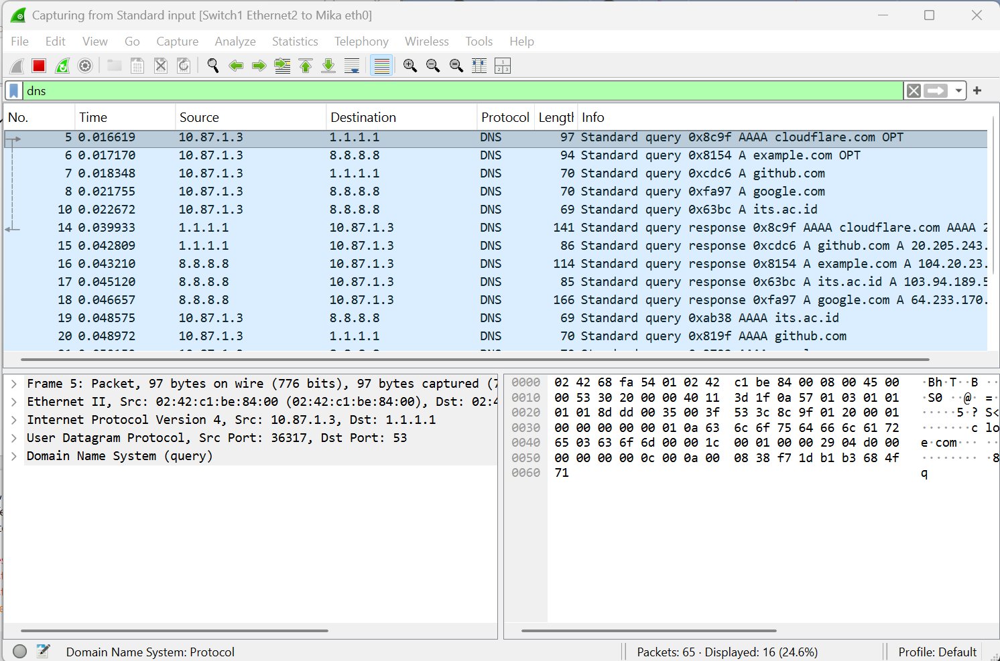  
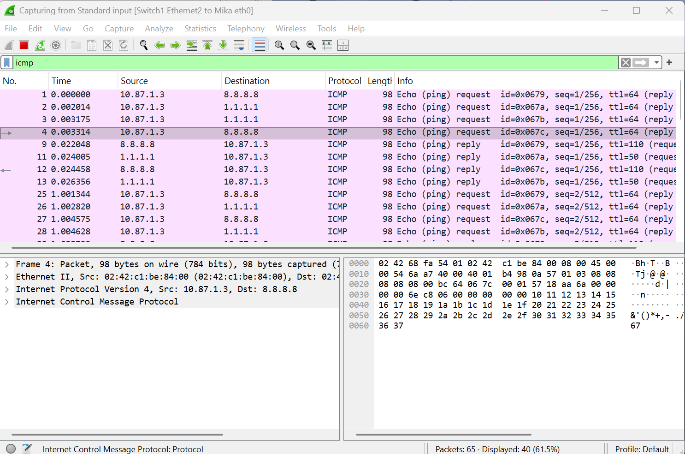  
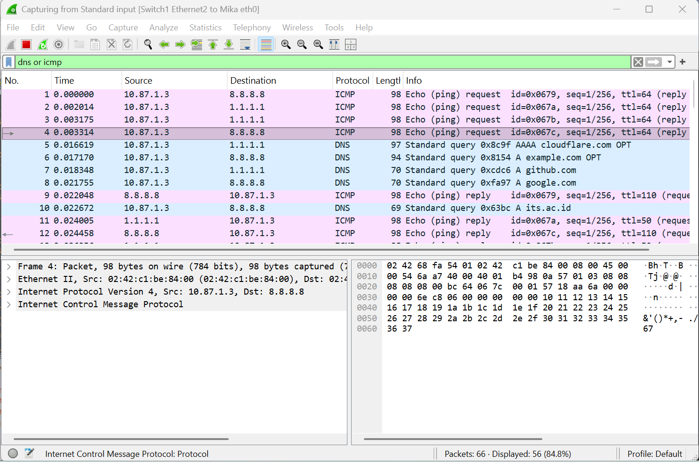

### Soal 7
tolong isi ya farrel

Hasil Tes:  
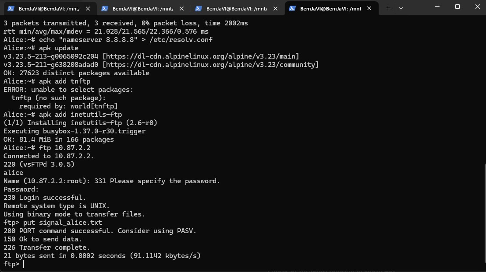  
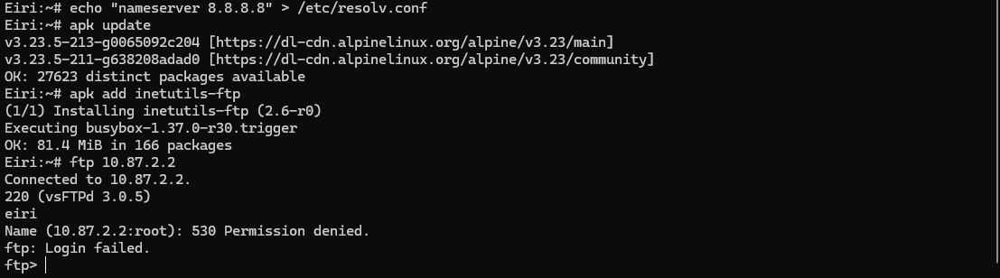

### Soal 8
1. Persiapkan file `knights_report.txt` di server **Knights**,
   ```
   nano knights_report.txt
   
   ==================================================
     KNIGHTS OF THE EASTERN CALCULUS — STATUS REPORT
     Protocol 7 Surveillance Network
     Classification: LEVEL 7 — EYES ONLY
   ==================================================
   
   Date: [CLASSIFIED]
   Agent: Knights Unit Alpha
   Node: Switch 3 — Subnet 10.<PREFIX>.3.0/24
   
   ---
   
   SUBJECT: Network Reconnaissance Report
   
   The Wired has been successfully infiltrated through
   Protocol 7 channels. Current observations:
   
   1. Router "Lain" has been identified as the central
      gateway node connecting all three subnet segments.
   
   2. Switch 1 (10.<PREFIX>.1.0/24) hosts Alice and Mika.
      Both nodes show standard traffic patterns.
   
   3. Switch 2 (10.<PREFIX>.2.0/24) hosts Chisa alone.
      Isolated subnet — minimal cross-traffic observed.
   
   4. Switch 3 (10.<PREFIX>.3.0/24) — our operational base.
      Knights and Eiri coexist on this segment.
   
   RECOMMENDATION:
   Continue monitoring FTP and Telnet sessions for
   plaintext credential exposure. SSH tunnels remain
   impenetrable without keylog access.
   
   --- END OF REPORT ---
   Knights of the Eastern Calculus
   "Let's all love Lain."
   ```
2. Masuk ke server **Chisa**, atur konfigurasi FTP agar bisa menerima dan upload file  
   ```
   nano /etc/vsftpd/vsftpd.conf
   # Tambahkan
   write_enable=YES
   allow_writeable_chroot=YES
   ```
3. Ke GNS3, Start capture dan Open Wireshark di kabel Lain-Switch 2
4. Kembali ke server **Chisa**, upload file dari **Knights** ke **Chisa** menggunakan akun **Alice**
   ```
   curl -T knights_report.txt ftp://10.87.2.2/ --user alice:alice
   ```
5. Buka Wireshark, lihat paket-paket yang masuk, lalu *apply filter**
   ```
   ftp
   ```
   Cek packet dengan status upload (STOR), kode status sukses server (226), dan port data TCP yang dinegosiasikan pada mode PASV.

Hasil Tes:  
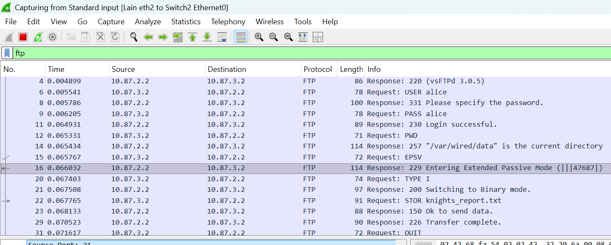  
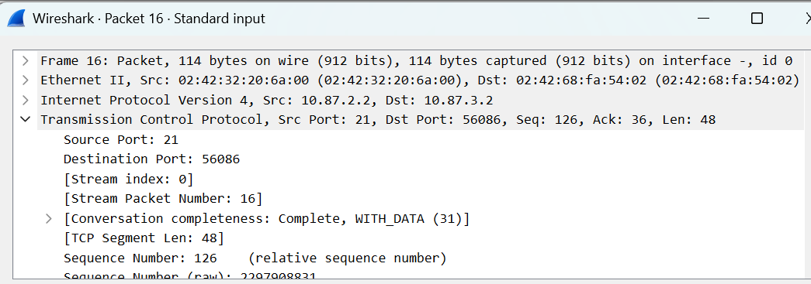

### Soal 9


Hasil Tes:  
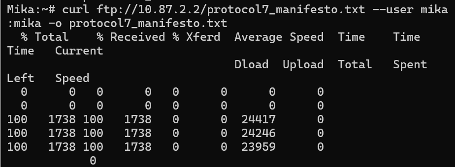

### Soal 10
tolong isi ya farrel

### Soal 11
tolong isi ya farrel

### Soal 12
tolong isi ya farrel

### Soal 13
tolong isi ya farrel

### Soal 14


Hasil Tes:  
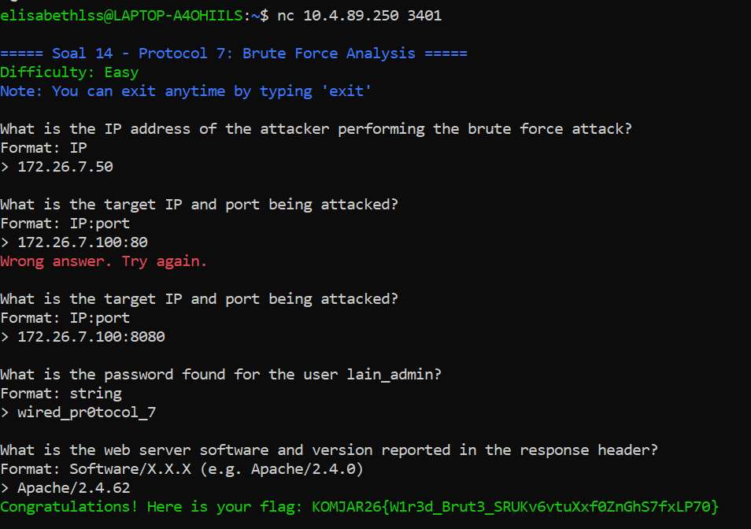

### Soal 15

Hasil Tes:  
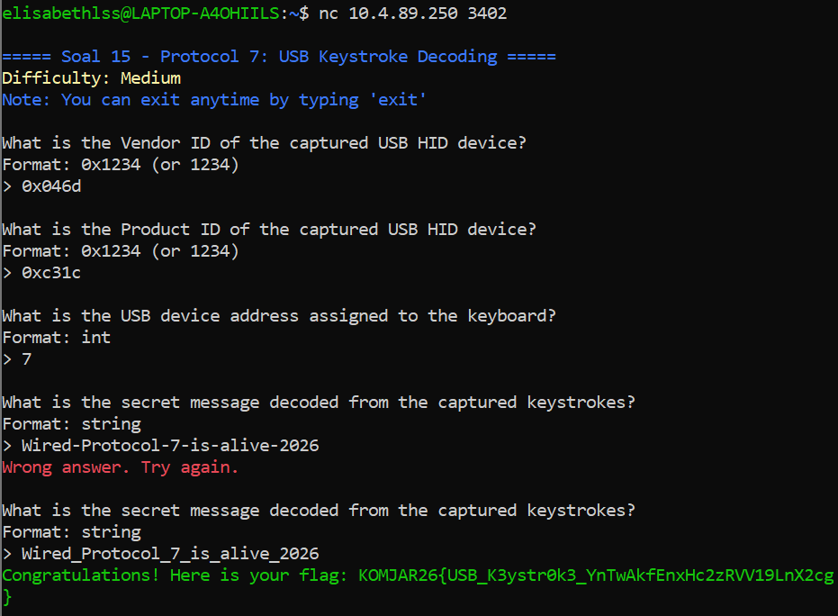

### Soal 16

Hasil Tes:  
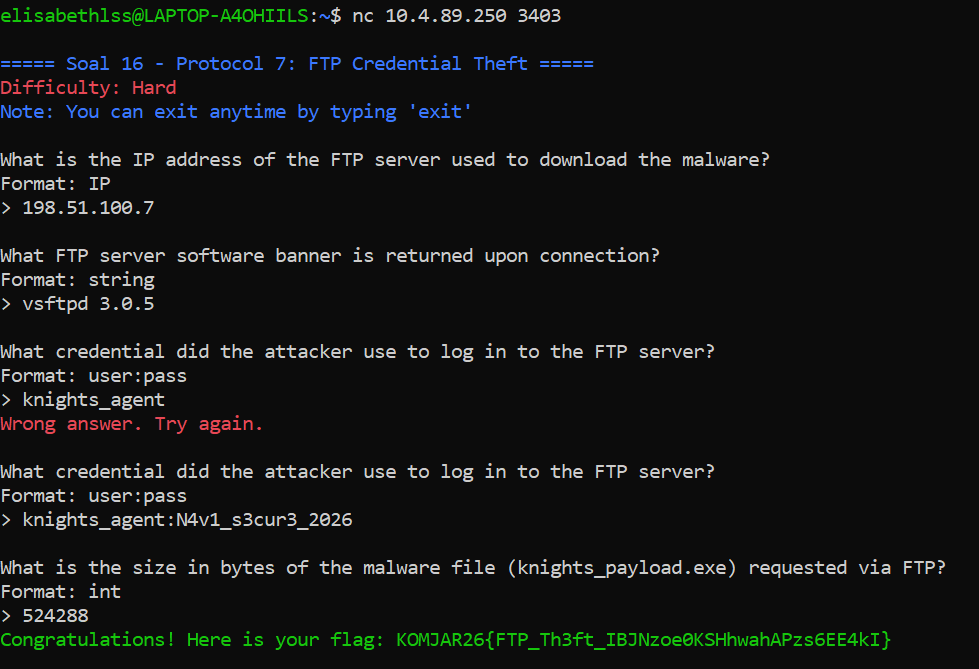


### Soal 17

Hasil Tes:  
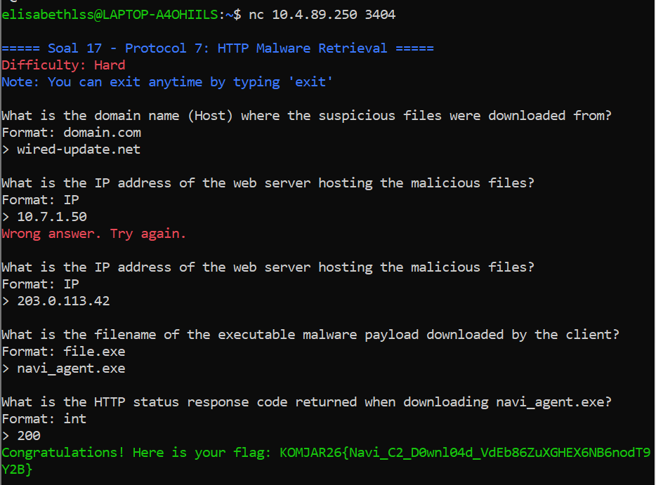

### Soal 18

Hasil Tes:  
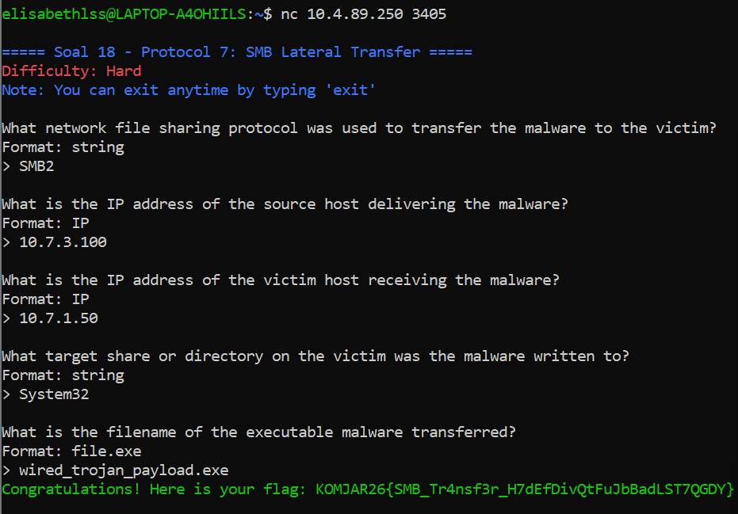

### Soal 19

Hasil Tes:  
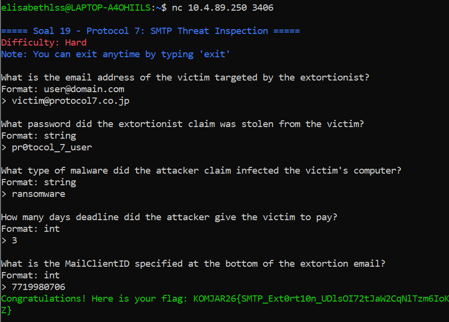

### Soal 20

Hasil Tes:  


## Kendala
