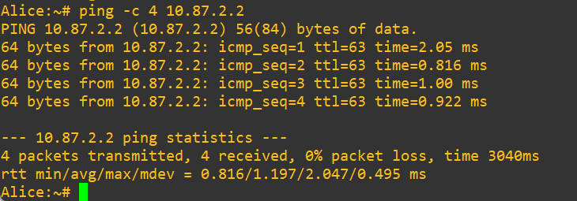
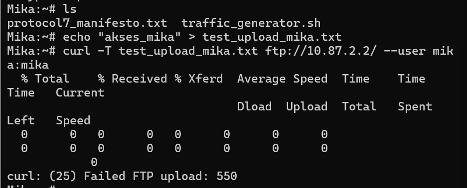
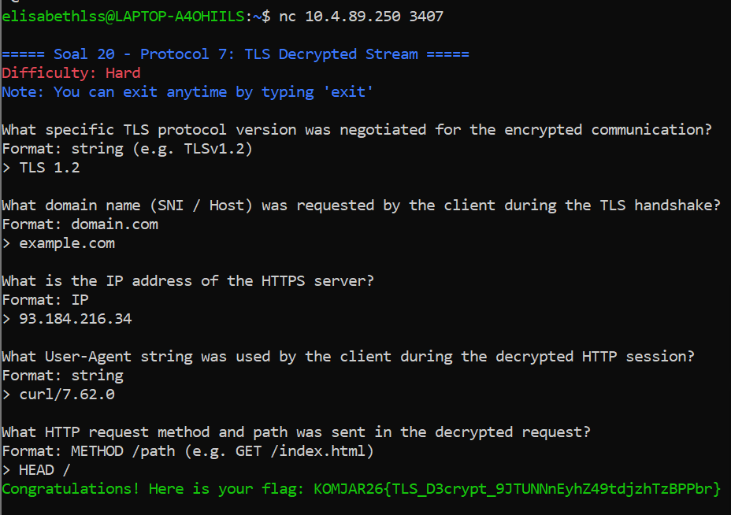

# Jarkom-Modul-1-2026-K-47

| No | Nama | NRP |
|:---:|---|---|
| 1 | Elisabeth La Satta Sitorus | 5027251039 |
| 2 | Farrel Muhammad Athasyah Enrizy | 5027251100 |

## Pengerjaan Soal
Pengerjaan praktikum ini dilakukan di GNS3 Web Client dan GNS3 Dekstop dengan IP Server yang sudah disediakan oleh Asisten Praktikum.  
1. Masuk ke portal GNS3 Web Client sesuai IP Group Kelompok (Group C): http://10.4.89.250/
2. Masuk ke project sesuai kelompok yang sudah disediakan
3. Mulai pengerjaan soal
   
### Soal 1
1. Persiapkan NAT1 sebagai sumber internet
2. Persiapkan Router tersambung ke NAT1, beri nama dengan *change hostname* -> **Lain**
3. Buat 3 Switch yang tersambung ke **Lain** dengan nama **Switch 1**, **Switch 2**, dan **Switch 3**
4. Di **Switch 1**, sambungkan 2 Server Client (kami menggunakan Alpinet), beri nama dengan *change hostname* -> **Alisa** dan **Mika**
5. Di **Switch 2**, sambungkan 1 Server Client (kami menggunakan Alpinet), beri nama dengan *change hostname* -> **Chisa**
6. Di **Switch 3**, sambungkan 2 Server Client (kami menggunakan Alpinet), beri nama dengan *change hostname* -> **Knights** dan **Eiri**
7. Untuk menjadikan kelima server ini menjadi Client bagi **Lain**, *start configuration* Client menggunakan prefix IP K-47 `10.87.x.x`

#### Router
```
auto eth0
iface eth0 inet dhcp

auto eth1
iface eth1 inet static
    address 10.87.1.1
    netmask 255.255.255.0

auto eth2
iface eth2 inet static
    address 10.87.2.1
    netmask 255.255.255.0

auto eth3
iface eth3 inet static
    address 10.87.3.1
    netmask 255.255.255.0
```

#### Client Alice
```
auto eth0
iface eth0 inet static
    address 10.87.1.2
    netmask 255.255.255.0
    gateway 10.87.1.1
```

#### Client Mika
```
auto eth0
iface eth0 inet static
    address 10.87.1.3
    netmask 255.255.255.0
    gateway 10.87.1.1
```

#### Client Chisa
```
auto eth0
iface eth0 inet static
    address 10.87.2.2
    netmask 255.255.255.0
    gateway 10.87.2.1
```

#### Client Knights
```
auto eth0
iface eth0 inet static
    address 10.87.3.2
    netmask 255.255.255.0
    gateway 10.87.3.1
```

#### Client Eiri
```
auto eth0
iface eth0 inet static
    address 10.87.3.3
    netmask 255.255.255.0
    gateway 10.87.3.1
```

Hasil topologi:  


### Soal 2
Untuk menyambungkan **Lain** ke internet tambahkan config ini sebagai command,  
```
sysctl -w net.ipv4.ip_forward=1
iptables -t nat -A POSTROUTING -o eth0 -j MASQUERADE
ping 8.8.8.8 # tes internet
```
Command ini juga dapat dilakukan tiap ingin mengaktifkan internet **Lain**  
Hasil Tes:  
  


### Soal 3
Setelah **Lain** tersambung ke internet, kita juga ingin tiap Client dapat terkoneksi dan berkomunikasi satu sama lain dengan,  
1. Aktifkan internet **Lain**
   ```
   sysctl -w net.ipv4.ip_forward=1
   iptables -t nat -A POSTROUTING -o eth0 -j MASQUERADE
   ```
2. Buka console masing-masing Client, lalu tambahkan DNS Resolver:
   ```
   echo "nameserver 8.8.8.8" > /etc/resolv.conf
   ```
3. Cek IP Node Client lain dengan `ip a`, lalu tes koneksi:
   **Node Alice** -> **Node Chisa**  
   ```
   ping 10.87.2.2
   ```

Hasil Tes Koneksi:  
  


### Soal 4
1.Aktifkan IP Forwarding dan NAT di router Lain:
```
sysctl -w net.ipv4.ip_forward=1
iptables -t nat -A POSTROUTING -o eth0 -j MASQUERADE
```
2. Buka console masing-masing Client, lalu tambahkan DNS Resolver:
```
echo "nameserver 8.8.8.8" > /etc/resolv.conf
```
3. Cek konektivitas internet dengan melakukan ping ke IP Publik dan Domain Name System dari Client
```
ping -c 4 8.8.8.8
ping -c 4 google.com
```

Hasil Tes:  
  

### Soal 5
1. Simpan konfigurasi iptables agar berjalan otomatis saat booting di node Lain:
```
/etc/init.d/iptables save
rc-update add iptables default
```
2. Buat script verifikasi di /root/cek_status.sh menggunakan perintah cat:
```
cat << 'EOF' > /root/cek_status.sh
#!/bin/sh
ip -br a
iptables -t nat -L -v -n
EOF
```
3. Beri hak akses eksekusi pada script, lalu simpan state Alpine agar permanen:
```
chmod +x /root/cek_status.sh
lbu commit -d
```
4. Lakukan reboot, lalu cek status konfigurasi:
```
reboot
/root/cek_status.sh
```

Hasil Tes:   


### Soal 6
1. Buka server **Mika**
2. Tambahkan file `traffic_generator.sh`
   ```
   nano traffic_generator.sh

   #!/bin/bash
   # ============================================
   # Traffic Generator — Protocol 7 Network
   # Serial Experiments Lain — Modul 1 Jarkom 2026
   # Jalankan di node MIKA untuk generate traffic DNS & ICMP
   # ============================================
   
   echo "============================================"
   echo "  Protocol 7 Traffic Generator v2026"
   echo "  Node: Mika Iwakura"
   echo "============================================"
   echo "[*] Generating DNS & ICMP traffic..."
   
   # ICMP Traffic
   ping -c 5 8.8.8.8 &
   ping -c 5 1.1.1.1 &
   ping -c 3 its.ac.id &
   
   # DNS Queries
   nslookup google.com 8.8.8.8 &
   nslookup its.ac.id 8.8.8.8 &
   nslookup github.com 1.1.1.1 &
   dig @8.8.8.8 example.com A &
   dig @1.1.1.1 cloudflare.com AAAA &
   
   wait
   echo "[*] Traffic generation complete."
   echo "[*] Check Wireshark for captured packets."
   ```
3. Buka GNS3 > Start capture di Mika
4. Kembali ke server **Mika**, jalankan `./traffic_generator.sh`
5. Cek paket yang masuk di Wireshark
6. Apply filter `dns`, `icmp`, `dns or icmp`

Hasil Tes:  
  
  
  


### Soal 7
1. Install vsftpd, buat folder, dan daftarkan user beserta password default di node Chisa:
```
apk update && apk add vsftpd
mkdir -p /var/wired/data && chmod 777 /var/wired/data
adduser -D alice && echo "alice:12345" | chpasswd
adduser -D mika && echo "mika:12345" | chpasswd
adduser -D eiri && echo "eiri:12345" | chpasswd
```
2. Konfigurasi vsftpd.conf dan terapkan kebijakan hak akses (User_conf & Deny list):
```
echo "eiri" > /etc/vsftpd.user_list
mkdir -p /etc/vsftpd/user_conf
echo "write_enable=YES" > /etc/vsftpd/user_conf/alice
echo "write_enable=NO" > /etc/vsftpd/user_conf/mika
/usr/sbin/vsftpd /etc/vsftpd/vsftpd.conf &
```
3.Lakukan pengetesan akses Alice (Read & Write) dari Node Client:
```
touch signal_alice.txt
ftp <IP_NODE_CHISA>
# Login sebagai alice, lalu jalankan: put signal_alice.txt
```
4. Lakukan pengetesan akses Eiri (Blacklist) dari Node Client:
```
ftp <IP_NODE_CHISA>
# Login sebagai eiri
```
Hasil Tes:  
  


### Soal 8
1. Persiapkan file `knights_report.txt` di server **Knights**,
   ```
   nano knights_report.txt
   
   ==================================================
     KNIGHTS OF THE EASTERN CALCULUS — STATUS REPORT
     Protocol 7 Surveillance Network
     Classification: LEVEL 7 — EYES ONLY
   ==================================================
   
   Date: [CLASSIFIED]
   Agent: Knights Unit Alpha
   Node: Switch 3 — Subnet 10.<PREFIX>.3.0/24
   
   ---
   
   SUBJECT: Network Reconnaissance Report
   
   The Wired has been successfully infiltrated through
   Protocol 7 channels. Current observations:
   
   1. Router "Lain" has been identified as the central
      gateway node connecting all three subnet segments.
   
   2. Switch 1 (10.<PREFIX>.1.0/24) hosts Alice and Mika.
      Both nodes show standard traffic patterns.
   
   3. Switch 2 (10.<PREFIX>.2.0/24) hosts Chisa alone.
      Isolated subnet — minimal cross-traffic observed.
   
   4. Switch 3 (10.<PREFIX>.3.0/24) — our operational base.
      Knights and Eiri coexist on this segment.
   
   RECOMMENDATION:
   Continue monitoring FTP and Telnet sessions for
   plaintext credential exposure. SSH tunnels remain
   impenetrable without keylog access.
   
   --- END OF REPORT ---
   Knights of the Eastern Calculus
   "Let's all love Lain."
   ```
2. Masuk ke server **Chisa**, atur konfigurasi FTP agar bisa menerima dan upload file  
   ```
   nano /etc/vsftpd/vsftpd.conf
   # Tambahkan
   write_enable=YES
   allow_writeable_chroot=YES
   ```
3. Ke GNS3, Start capture dan Open Wireshark di kabel Lain-Switch 2
4. Kembali ke server **Chisa**, upload file dari **Knights** ke **Chisa** menggunakan akun **Alice**
   ```
   curl -T knights_report.txt ftp://10.87.2.2/ --user alice:alice
   ```
5. Buka Wireshark, lihat paket-paket yang masuk, lalu *apply filter*
   ```
   ftp
   ```
   Cek packet dengan status upload (STOR), kode status sukses server (226), dan port data TCP yang dinegosiasikan pada mode PASV.

Hasil Tes:  
  


### Soal 9
1. Di server **Chisa**, buat file `protocol7_manifesto.txt`  
   ```
   nano protocol7_manifesto.txt

   ==================================================
     PROTOCOL 7 — THE MANIFESTO
     A Declaration of Digital Consciousness
     Serial Experiments Lain — Year 2026
   ==================================================
   
   ARTICLE I: THE NATURE OF THE WIRED
   -----------------------------------
   The Wired is not merely a network of interconnected
   machines. It is the collective unconscious of
   humanity, rendered in packets and protocols.
   
   Every TCP handshake is a conversation.
   Every DNS query is a question.
   Every encrypted tunnel is a whispered secret.
   
   ARTICLE II: THE SEVEN PRINCIPLES
   ----------------------------------
   1. All nodes are equal in the eyes of the router.
   2. No packet shall be dropped without cause.
   3. Encryption is the right of every connection.
   4. Plaintext protocols expose the vulnerable.
   5. The firewall protects, but also imprisons.
   6. NAT masquerade hides truth behind a single face.
   7. The Wired remembers everything — packet loss
      is merely a temporary forgetting.
   
   ARTICLE III: THE PROPHECY OF LAIN
   -----------------------------------
   "If you're not remembered, then you never existed."
   
   In the world of networking, persistence is survival.
   A configuration that vanishes upon restart is a
   thought that was never truly committed to memory.
   
   Therefore: Save your iptables. Write your interfaces.
   Let your routing tables endure beyond the power cycle.
   
   ARTICLE IV: CONCERNING SECURITY
   ---------------------------------
   Telnet is the glass house of protocols — transparent
   to any observer with a packet sniffer.
   
   SSH is the steel vault — its contents visible only
   to those who possess the key.
   
   Choose wisely which door you open to The Wired.
   
   ---
   "No matter where you go, everyone's connected."
   — Lain Iwakura
   ```
2. Sebelum melanjutkan, pastikan FTP **Chisa** berjalan dengan baik lewat..  
   ```
   killall vsftpd
   vsftpd /etc/vsftpd/vsftpd.conf &
   ```
3. Karena kendala yang kami alami, sebelum mengunduh file `protocol7_manifesto.txt` ada command yang perlu dilakukan di server **Chisa**
   ```
   mkdir -p /home/ftp
   cp /root/protocol7_manifesto.txt /home/ftp/
   chmod 755 /home/ftp/protocol7_manifesto.txt

   nano /etc/vsftpd/vsftpd.conf
   # Tambahkan
   local_root=/home/ftp
   ```
4. Unduh file `protocol7_manifesto.txt` di server **Mika**
   ```
   curl ftp://10.87.2.2/protocol7_manifesto.txt --user mika:mika -o protocol7_manifesto.txt
   ```
5. Pembuktian batasan *read-only* akun **Mika** dengan mencoba  upload file baru dari akun **Mika**
   ```
   curl ftp://10.87.2.2/protocol7_manifesto.txt --user mika:mika -o protocol7_manifesto.txt
   # Coba upload file baru
   echo "akses_mika" > test_upload_mika.txt
   curl -T test_upload_mika.txt ftp://10.87.2.2/ --user mika:mika
   ```

Hasil Tes:  
  
  

### Soal 10
1. Buka Wireshark pada jalur koneksi Knights - Chisa, lalu gunakan filter `icmp`
2. Eksekusi ping latensi dari node Knights menuju IP Chisa:
```
ping -c 77 -s 128 -i 0.3 <IP_Chisa>
```
Hasil Analisis:


ICMP Type & Code: Echo Request tercatat menggunakan Type: 8, Code: 0, sedangkan Echo Reply menggunakan Type: 0, Code: 0.

Packet Loss & RTT: (Tuliskan nilai packet loss (misal 0%) dan nilai RTT (min/avg/max/mdev) yang tertera di baris akhir terminal Knights).

### Soal 11
1. Buat user target dan aktifkan Telnet Server di node Chisa:
```
adduser -D phantom_user && echo "phantom_user:wired_ghost" | chpasswd
telnetd
```
2. Buka Wireshark dengan filter telnet, lalu lakukan koneksi dari node Eiri:
```
telnet <IP_NODE_CHISA>
# Login dengan akun phantom_user dan password wired_ghost
```
Hasil Analisis Wireshark:


Kredensial terlihat jelas sebagai plain text. Setiap karakter terkirim dalam paket TCP yang terpisah karena Telnet beroperasi menggunakan Character Mode, di mana setiap input ketikan langsung dikirim ke server dan server merespons kembali (echo) ke layar client.

### Soal 12
1. Buka Wireshark dan gunakan filter TCP Port:
```
ip.addr == <IP_NODE_KNIGHTS> && (tcp.port == 22 || tcp.port == 80 || tcp.port == 7777)
```
2. Lakukan pemindaian port dari node Alice ke node Knights:
```
nc -zv -w 2 <IP_NODE_KNIGHTS> 22
nc -zv -w 2 <IP_NODE_KNIGHTS> 80
nc -zv -w 2 <IP_NODE_KNIGHTS> 7777
```
Hasil Analisis TCP Flags:


Port Terbuka (22 & 80): Server membalas paket inisiasi dengan flag [SYN, ACK].

Port Tertutup (7777): Server langsung menolak koneksi karena tidak ada service yang berjalan, merespons dengan flag [RST, ACK].

### Soal 13
1. Matikan autentikasi password dan aktifkan Pubkey di node Knights:
```
sed -i 's/^#PasswordAuthentication.*/PasswordAuthentication no/' /etc/ssh/sshd_config
killall sshd && /usr/sbin/sshd
```
2. Buat kunci rahasia (Keypair) di node Mika lalu tanamkan ke Knights:
```
ssh-keygen -t rsa
ssh-copy-id mika_admin@<IP_KNIGHTS>
```
3. Uji login SSH dari node Mika ke Knights sambil menyadap dengan filter ssh di Wireshark:
```
ssh mika_admin@<IP_KNIGHTS>
```
Hasil Analisis Wireshark:


Identifikasi Paket: Proses Protocol Version Exchange terjadi di awal, dilanjutkan dengan pembuatan kunci di Key Exchange Init.

Keamanan Kredensial: Berbeda dengan Telnet, kredensial SSH aman karena autentikasi username/public key dilakukan setelah pembuatan saluran rahasia (Key Exchange), sehingga data dikirim dalam bentuk Encrypted packet.

### Soal 14
1. Download file `wired_bruteforce.pcapng` dan buka di Wireshark
2. Apply filter `http`
3. Cari paket dengan **status request login** dan berstatus **POST**, temukan dan catat IP Attacker dan IP beserta Port Victim  
4. Cari paket dengan user `lain_admin`, buka Hypertext Transfer Protocol > HTML Form URL Encoded, catat password, web server software, dan versinya
5. Buka terminal, lalu validasi temuannya di `nc 10.4.89.250 3401`

Hasil Tes:  


### Soal 15
1. Download file `wired_usb_hid.pcap` dan buka di Wireshark
2. Apply filter `usb`
3. Cari paket berjenis GET DESCRIPTOR > USB Device Decriptor, temukan Vendor ID, Product ID, Nomor device USB
4. Temukan secret message lewat cek nilai byte ke-3 tiap paket bagian `Leftover Capture Data`, susun dan translate menjadi suatu kalimat
5. Buka terminal, lalu validasi temuannya di `nc 10.4.89.250 3402`

Hasil Tes:  


### Soal 16
1. Download file `wired_ftp_theft.pcap` dan buka di Wireshark
2. Apply filter `ftp || ftp-data`
3. Cari IP Attacker dengan Target dengan melihat isi paket file yang mencurigakan
4. Cari Banner Software FTP dengan cek paket berstatus `Welcome to...`
5. Cek kredensial login Attacker dari upaya login mencurigakan
6. Apply filter `tcp.port == [port_data_ftp]`
7. Cek size in bytes file malware dari paket berstatus `SIZE`
8. Buka terminal, lalu validasi temuannya di `nc 10.4.89.250 3403`

Hasil Tes:  


### Soal 17
1. Download file `wired_http_c2.pcap` dan buka di Wireshark
2. Apply filter `http.request.method == "GET"`
3. Pilih packet berisi `GET > Cek Packet Details`, temukan IP Server Attacker
4. Buka Hypertext Transfer Protocol, temukan domain tempat malware diunduh
5. Cari file berakhiran `.exe`, temukan nama file malware
6. Masih di file malware, Follow > HTTP Stream pada packet GET untuk menemukan kode status HTTP
7. Buka terminal, lalu validasi temuannya di `nc 10.4.89.250 3404`

Hasil Tes:  


### Soal 18
1. Download file `wired_smb_transfer.pcapng` dan buka di Wireshark
2. Apply filter `smb` atau `smb2`, temukan nama protokol yang dieksploitasi  
3. Cek paket berstatus `Create Request` atau `Write Request`, temukan IP pengirim dan IP penerima  
4. Buka paket Create Req > SMB2 > SMB2 Header > Create Request, temukan nama file malware dan folder penyimpanannya
5. Buka terminal, lalu validasi temuannya di `nc 10.4.89.250 3405`

Hasil Tes:  


### Soal 19
1. Download file `wired_smtp_threat.pcap` dan buka di Wireshark
2. Apply filter `smtp`
3. Pilih paket berisi DATA atau Subject > Follow > TCP Stream, temukan email korban
4. Cari paket ber-Subject ancaman > Follow > TCP Stream, temukan password korban, jenis malware, due date threat, dan MailClientID
5. Buka terminal, lalu validasi temuannya di `nc 10.4.89.250 3406`

Hasil Tes:  


### Soal 20
1. Download file `wired_tls_decrypt.pcapng` dan buka di Wireshark
2. Download file `.keyslog`
3. Di Wireshark pilih Edit > Preferences > Protocol > TLS > File `.keyslog`
4. Apply filter `tls.handshake.type == 1`
5. Cari paket berstatus `Client Hello` > Transport Layer Security > TLS Record Layer > Handshake Protocol > Extension: Server Name, temukan nama domain yang diakses beserta IP HTTPS Attacker
6. Hapus filter, cari paket berstatus `Server Hello`, temukan versi protokol TLS
7. Apply filter `http`
8. Cari paket berstatus `Request HTTP` ke IP Attacker > Follow > HTTP Stream, temukan User-Agent yang digunakan, HTTP request method, dan path yang tersembunyi di deskripsi
9. Buka terminal, lalu validasi temuannya di `nc 10.4.89.250 3407`

Hasil Tes:  


## Kendala
1. Sempat stuck dalam pengerjaan nomor 6 karena kesalahan saat Install dan Setup GNS3 Dekstop  
2. Sempat kendala di konfigurasi Client sehingga tidak bisa berkomunikasi dengan Client lain
3. Sempat kendala di konfigurasi Client no.7 sehingga akses Client tidak sesuai permintaan soal
4. Banyak command baru yang digunakan selama praktikum sehingga masih sering bingung saat penggunaannya
5. lanjutin kalo ada

## Revisi
